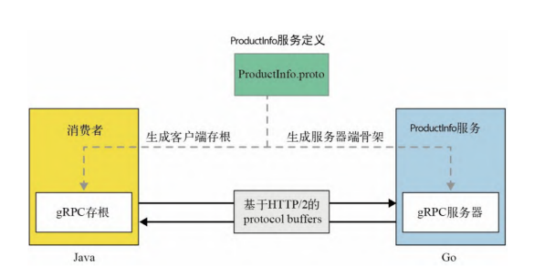

# 第1章 gPRC入门

## 1.1 gRPC的定义

进程间通信通常会采用消息传递的方式来实现,要么是**同步的请求-响应风格**,要么是**异步的事件驱动风格**.在同步通信风格中,客户端进程通过网络发送请求消息到服务器进程,并等待响应消息.在异步的事件驱动风格中,进程间会通过异步消息传递进行通信,这个过程会用到一个中介,也就是**事件代理(event broker)**.可以根据业务场景,选择希望实现的通信模式.

传统的同步通信方式是RESTful服务,也就是将应用程序或服务建模为一组资源,这些资源可以通过HTTP的网络调用进行访问和状态变更.但是,对于大多数使用场景来说,使用RESTful服务来实现进程间通信显得过于笨重、低效并且易于出错.通常需要扩展性强、松耦合的进程间通信技术,该技术比RESTful服务更高效.**gRPC主要采用同步的请求–响应风格进行通信,但在建立初始连接后,它完全可以以异步模式或流模式进行操作**.

**gRPC:是一项进程间通信技术,可以用来连接、调用、操作和调试分布式异构应用程序.就像调用本地函数一样,整个过程操作起来很简单**.

在开发gRPC应用程序时,先要定义服务接口,其中应包含如下信息:

- **消费者消费服务的方式**
- **消费者能够远程调用的方法**
- **调用这些方法所使用的参数和消息格式**

**接口定义语言(interface definition language, IDL):在服务定义中使用的语言叫做接口定义语言**.

借助服务定义,可以生成服务器端代码,也就是服务器端**骨架**,它通过提供低层级的通信抽象简化了服务器端的逻辑.同时,还可以生成客户端代码,也就是客户端**存根**,它使用抽象简化了客户端的通信,为不同的编程语言隐藏了低层级的通信.就像调用本地函数那样,客户端能够远程调用我们在服务接口定义中所指定的方法.

注:**此处的"骨架"和"存根"都是代理**.服务器端代理叫做"骨架"(skeleton),客户端代理叫做"存根"("stub")

假设我们正在构建一个在线零售应用程序,该应用程序由多个微服务组成.如下图示:

- ProductInfo.proto:该文件用于定义服务,服务器端和客户端都会使用该文件来生成代码
- ProductInfo服务:假设服务端使用GO语言实现
- 消费者:假设消费者使用JAVA语言来实现
- 二者之间的通信则通过HTTP/2来进行

### 1.1.1 服务定义

### 1.1.2 gRPC服务器端

### 1.1.3 gRPC客户端

### 1.1.4 客户端-服务器端的消息流