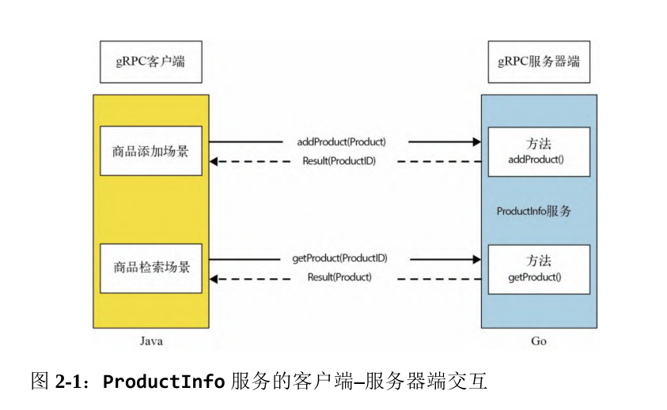

# 第2章 开始使用gRPC

## 2.1 创建服务定义

ProductInfo 服务的客户端–服务器端交互



在开发gRPC应用程序时,要先定义服务接口,其中包含:

- 允许远程调用的方法
- 方法参数
- 调用这些方法所使用的消息格式

这些服务定义都以protocol buffers定义的形式进行记录,也就是gRPC中所使用的接口定义语言(IDL).

在确定了服务的业务功能之后,就可以定义服务接口来满足业务需要了.在本示例中,可以看到ProductInfo服务有两个远程方法,即:

- `addProduct(Product)`:入参类型为`Product`,返回值类型为`ProductID`
- `getProduct(ProductID)`:入参类型为`ProductID`,返回值类型为`Product`

接下来以protocol buffers定义的形式声明这些服务定义.protocol buffers可以定义**消息类型**和**服务类型**:

- 消息类型
	- 字段
		- 类型
		- 唯一索引值
- 服务类型
	- 方法
		- 类型
		- 输入参数
		- 输出参数

### 2.1.1 定义消息类型

消息(`message`):是客户端和服务器端交换的数据结构

在本章的示例`ProductInfo`中,有2个消息类型:

- `Product`:用于在系统中添加新的商品,另外当检索特定的商品时,它也会用作返回值
- `ProductID`:型是商品的唯一标识,用于从系统中检索特定商品,当添加新商品时,它也会用作返回值

- `ProductID`

`ProductID`是商品的唯一标识,可以是字符串类型的值.我们也可以自定义包含字符串字段的消息类型,亦或使用`protocol buffers`库所提供的较为流行的消息类型 `google.protobuf.StringValue`.本例将自定义包含字符串字段的消息类型.

TODO:`google.protobuf.StringValue`是啥? protocol buffers中的一个定义?

- `Product`

`Product`是自定义消息类型,代表在线零售应用程序中的商品应该具有的数据.它包含一组字段,这些字段代表每个商品所关联的数据.假设`Product`消息类型有如下字段:

- `id`:商品的唯一标识符
- `name`:商品的名称
- `description`:商品的描述
- `price`:商品的价格

`product_info.proto`:

```proto
syntax = "proto3";

package ecommerce;

message ProductID {
  string value = 1;
}

message Product {
  // id 商品唯一标识符
  string id = 1;
  // name 商品名称
  string name = 2;
  // description 商品描述
  string description = 3;
  // price 商品价格
  float price = 4;
}
```

这里每个消息字段的`=`右侧的数字用于**在消息中标识该字段**.因此,**在同一个消息定义中,不能为两个字段设置相同的数字**.就现在来讲,可以将其视为定义protocol buffers消息的一个规则.

目前已完成了`ProductInfo`服务消息类型的定义,下面来看一下服务接口的定义.

### 2.1.2 定义服务类型

服务(`service`):是暴露给客户端的**远程方法**集合

在本章的示例`ProductInfo`中,有2个**远程方法**:

- `addProduct(Product)`
- `getProduct(ProductID)`

**按照protocol buffers的规则,远程方法只能有一个参数,并只能返回一个值**.如果需要像`addProduct`方法那样给方法传递多个值,就要定义一个消息类型,并对所有的值进行分组,就像在Product`消息类型中所做的那样.

```go
syntax = "proto3";

package ecommerce;

service ProductInfo {
  // addProduct 添加商品
  rpc addProduct(Product) returns (ProductID);
  // getProduct 获取商品
  rpc getProduct(ProductID) returns (Product);
}

message ProductID {
  string value = 1;
}

message Product {
  // id 商品唯一标识符
  string id = 1;
  // name 商品名称
  string name = 2;
  // description 商品描述
  string description = 3;
  // price 商品价格
  float price = 4;
}
```

本例中:

- `syntax = "proto3";`:服务定义首先要指定使用的protocol buffers版本(本例中是proto3)
- `package ecommerce;`:为了避免协议消息类型之间的命名冲突,这里使用了包名,它也会用于生成代码
	- TODO:协议消息类型之间的命名冲突是指什么?
- `service ProductInfo`:服务接口的定义
- `rpc addProduct(Product) returns (ProductID);`:用于添加商品的远程方法,它会返回商品ID作为响应
- `rpc getProduct(ProductID) returns (Product);`:基于商品ID获取商品的远程方法
- `message Product`:`Product`消息类型(格式)的定义
- `string id = 1;`:用来保存商品ID的字段(名–值对),使用**唯一的数字来标识二进制消息格式中的各个字段**
- `message ProductID`:`ProductID`消息类型(格式)的定义

在protocol buffers定义中,可以指定包名(如本例中的`ecommerce`),这样做能够**避免在不同的项目间出现命名冲突**,当使用这个包属性生成服务或客户端代码时,除非明确指明了不同的包名,否则将为对应的编程语言生成相同的包.在定义包名的时候,还可以使用版本号,如 `ecommerce.v1`和`ecommerce.v2`.这样一来,未来对API的主要变更就可以在相同的代码库中共存

还有一个过程需要注意:从其他proto文件中进行导入.

例如:我们要使用`wrappers.proto`文件中的`StringValue`类型(`google.protobuf.StringValue`),则按如下方式在定义中导入**文件**`google/protobuf/wrappers.proto`:

```proto
syntax = "proto3";

import "google/protobuf/wrappers.proto";

package ecommerce;

service ProductInfo {
  // addProduct 添加商品
  rpc addProduct(Product) returns (google.protobuf.StringValue);
  // getProduct 获取商品
  rpc getProduct(google.protobuf.StringValue) returns (Product);
}

message ProductID {
  string value = 1;
}

message Product {
  // id 商品唯一标识符
  string id = 1;
  // name 商品名称
  string name = 2;
  // description 商品描述
  string description = 3;
  // price 商品价格
  float price = 4;
}
```


这里我猜测import的应该是`/usr/local/protobuf/include/google/protobuf/wrappers.proto`这个文件